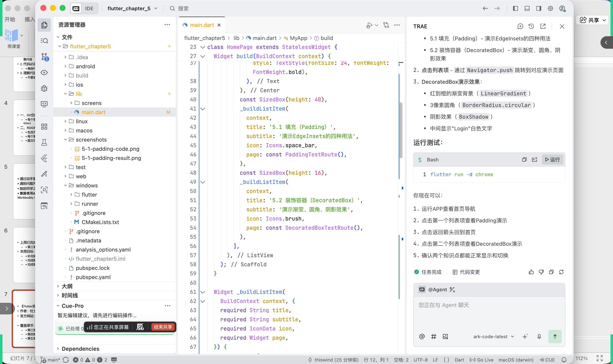
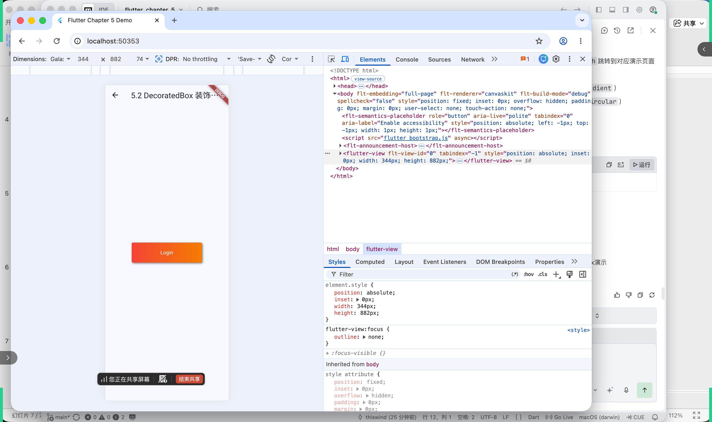

# Flutter Chapter 5 - 容器类组件

本项目用于学习和复现Flutter第5章「容器类组件」的各个知识点。

---

## 5.1 填充（Padding）

### 知识点说明

Padding是Flutter中用于给子组件添加填充（内边距）的组件。它可以在子组件的四周添加指定的空白区域，是布局中最常用的组件之一。

**主要特性：**
- `EdgeInsets.all(double value)`: 四个方向统一设置相同的填充值
- `EdgeInsets.only({left, top, right, bottom})`: 单独指定某一个或多个方向的填充值
- `EdgeInsets.symmetric({vertical, horizontal})`: 分别设置垂直和水平方向的填充值
- `EdgeInsets.fromLTRB(left, top, right, bottom)`: 分别指定左、上、右、下四个方向的填充值

> **实例程序来源：** [Flutter实战·第二版 - 5.1.3 示例](https://book.flutterchina.club/chapter5/padding.html#_5-1-3-%E7%A4%BA%E4%BE%8B)
> **源码位置：** [lib/main.dart#L87-L119](https://github.com/thiswind/flutter-chapter5/blob/main/lib/main.dart#L87-L119)

### 演示效果

<div align="center">
  <table>
    <tr>
      <td align="center">
        <strong>代码截图</strong>
      </td>
      <td align="center">
        <strong>运行效果</strong>
      </td>
    </tr>
    <tr>
      <td>
        
      </td>
      <td>
        
      </td>
    </tr>
  </table>
</div>

### 核心代码示例

```dart
Padding(
  padding: const EdgeInsets.all(16),
  child: Column(
    crossAxisAlignment: CrossAxisAlignment.start,
    mainAxisSize: MainAxisSize.min,
    children: const <Widget>[
      Padding(
        padding: EdgeInsets.only(left: 8),
        child: Text("Hello world"),
      ),
      Padding(
        padding: EdgeInsets.symmetric(vertical: 8),
        child: Text("I am Jack"),
      ),
      Padding(
        padding: EdgeInsets.fromLTRB(20, 0, 20, 20),
        child: Text("Your friend"),
      )
    ],
  ),
)
```

---

## 5.2 装饰容器（DecoratedBox）

### 知识点说明

DecoratedBox是一个可以在子组件绘制前后（或之后）绘制装饰的组件，支持背景色、渐变、圆角、阴影等效果。

**主要特性：**
- `LinearGradient`: 线性渐变背景
- `BorderRadius`: 圆角效果
- `BoxShadow`: 阴影效果（颜色、偏移、模糊半径）

> **实例程序来源：** [Flutter实战·第二版 - 5.2 装饰容器](https://book.flutterchina.club/chapter5/decoratedbox.html#_5-2-%E8%A3%85%E9%A5%B0%E5%AE%B9%E5%99%A8-decoratedbox)
> **源码位置：** [lib/main.dart#L121-L156](https://github.com/thiswind/flutter-chapter5/blob/main/lib/main.dart#L121-L156)

### 演示效果

<div align="center">
  <table>
    <tr>
      <td align="center">
        <strong>代码截图</strong>
      </td>
      <td align="center">
        <strong>运行效果</strong>
      </td>
    </tr>
    <tr>
      <td>
        
      </td>
      <td>
        
      </td>
    </tr>
  </table>
</div>

### 核心代码示例

```dart
DecoratedBox(
  decoration: BoxDecoration(
    gradient: LinearGradient(
      colors: [Colors.red, Colors.orange.shade700],
    ),
    borderRadius: BorderRadius.circular(3.0),
    boxShadow: const [
      BoxShadow(
        color: Colors.black54,
        offset: Offset(2.0, 2.0),
        blurRadius: 4.0,
      ),
    ],
  ),
  child: Padding(
    padding: const EdgeInsets.symmetric(horizontal: 80.0, vertical: 18.0),
    child: const Text(
      "Login",
      style: TextStyle(color: Colors.white),
    ),
  ),
)
```

---

## 目录说明

- `lib/main.dart`: 主程序入口
- `screenshots/`: 各知识点的截图素材

---

## 运行方式

```bash
flutter run -d chrome
```
